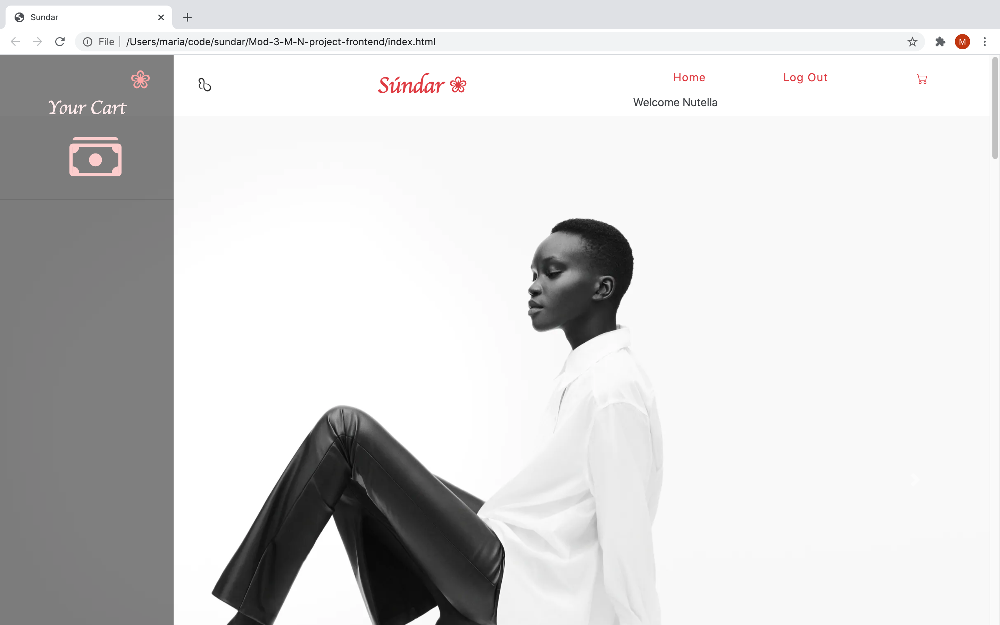

## Sundar Backend

This is the backend repo of Sundar, an e-commerce app for women's accessories. 

### Tech Stack

* Vanilla Javascript
* Ruby on Rails API
* PostgreSQL DB

### Clone the repo, cd into the folder and run the following commands to start Rails server.

* bundle install
* rails db:create
* rails db:migrate
* rails s -p 3000

[Frontend Repo](https://github.com/21shield/Mod-3-M-N-project-frontend)
